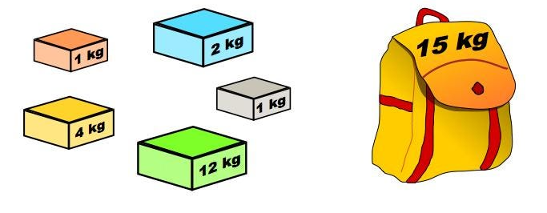

# Knapsack Algorithm

## Description
The Knapsack Problem is a classic combinatorial optimization problem commonly encountered in resource allocation scenarios. Decision-makers are tasked with selecting from a set of indivisible items or tasks within fixed budget or time constraints. The objective is to optimize by choosing the best combination to maximize a specific goal, such as profit, efficiency, or meeting particular requirements, within the confines of limited resources.




## Gold
There is a backpack with a fixed capacity and a series of items, each with its own weight and value. The capacity of a backpack limits the total weight of items that can be placed, and each item has a specific value. The goal is to select a group of items to be placed in the backpack without exceeding its capacity, in order to maximize the total value of these items.

## Pseudocode

```

```
### Algorithmic principle


## Algorithm application


## Algorithm implement
The Implementation of Algorithms in C++
```


```

## Time complexity


## Results
