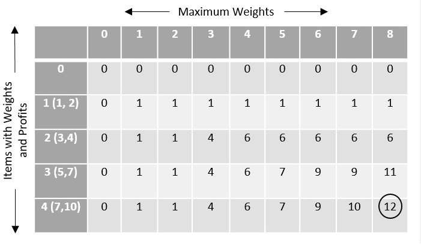

# Knapsack Problem

## Introduction
Knapsack problem is a combinatorial optimization NP complete problem, which refers to the common problem of packaging your most valuable or useful items without overloading your luggage.

## Description
The Knapsack Problem is a classic combinatorial optimization problem commonly encountered in resource allocation scenarios. Decision-makers are tasked with selecting from a set of indivisible items or tasks within fixed budget or time constraints. The objective is to optimize by choosing the best combination to maximize a specific goal, such as profit, efficiency, or meeting particular requirements, within the confines of limited resources.




## Gold
There is a backpack with a fixed capacity and a series of items, each with its own weight and value. The capacity of a backpack limits the total weight of items that can be placed, and each item has a specific value. The goal is to select a group of items to be placed in the backpack without exceeding its capacity, in order to maximize the total value of these items.

## The two different types of Knapsack
### 0-1 Knapsack Problem
Each item can either be fully included in the knapsack or not included at all. This means that for each item, there are only two choices: either to place it in the knapsack or to exclude it.
### Fractional Knapsack Problem
Each item can be partially included in the knapsack; it does not have to be fully included or excluded. This implies that it is possible to select a fraction of an item to place in the knapsack rather than committing to the whole item or excluding it entirely.
## Solution

### False Start

#### Pseudocode
```
function knapsack_false_start(n, weights[], values[], W):
    M = array[n+1][W+1]
    for w from 0 to W:
        M[0][w] = 0
    for i from 1 to n:
        for w from 0 to W:
            if weights[i] > w:
                M[i][w] = M[i-1][w]
            else:
                with_i = values[i] + M[i-1][w - weights[i]]
                without_i = M[i-1][w]
                M[i][w] = max(with_i, without_i)
    return M[n][W]
```
#### Algorithmic principle
This method emphasizes the consideration of more subproblems to account for different scenarios. It involves defining a function to represent the optimal solution of the problem and considering two possibilities: selecting the current item or not selecting it. If the current item is chosen, it might require considering previously selected items, but it doesn't necessarily imply that selecting the current item will lead to the exclusion of other items. By addressing these scenarios and subproblems, this approach aims for a more comprehensive solution to the problem.


#### Algorithm implement
The Implementation of Algorithms in C++
```
int knapsack_false_start(int n, vector<int>& weights, vector<int>& values, int W) {
    // Create a 2D array to store the maximum values for subproblems
    vector<vector<int>> M(n + 1, vector<int>(W + 1, 0));

    // Iterate over each item
    for (int i = 1; i <= n; ++i) {
        // Iterate over each possible weight capacity
        for (int w = 0; w <= W; ++w) {
            // If the current item's weight exceeds the current capacity, don't select it
            if (weights[i] > w) {
                M[i][w] = M[i - 1][w];
            } else {
                // Consider two possibilities: including the current item or not
                // If including the current item, calculate the value
                int with_i = values[i] + M[i - 1][w - weights[i]];
                // If not including the current item, the value remains the same as for the previous item
                int without_i = M[i - 1][w];
                // Choose the maximum value between including and not including the current item
                M[i][w] = max(with_i, without_i);
            }
        }
    }

    // Return the maximum value after considering all items and weight capacities
    return M[n][W];
}

```

#### Time complexity
The time complexity of the False Start method is O(n W), where n is the number of items and W is the capacity of the knapsack. In the False Start method, we need to fill in an n×W 2D array to store intermediate results, and for each item, we need to consider every possible knapsack capacity.

### Adding a New Variable

#### Pseudocode
```
function knapsack_with_new_variable(n, weights[], values[], W): 
    M = array[n+1][W+1]
    for i from 1 to n:
        for w from 0 to W:
            new_variable = ...
            M[i][w] = max(...)
    return M[n][W]
```

#### Algorithmic principle
By adding this new variable, the algorithm can better capture the constraints and characteristics of the problem, which can lead to a more efficient and effective solution strategy.
In the context of the knapsack problem, the new variable typically represents some additional information that helps to refine the problem's formulation. This could be, for example, the remaining capacity of the knapsack or the fraction of a particular item that is included in the knapsack.
By incorporating this additional variable into the algorithm, it becomes possible to consider a wider range of possibilities and make more informed decisions at each step of the problem-solving process. This can ultimately lead to improved performance and accuracy in finding the optimal solution to the knapsack problem.

#### Algorithm implement
The Implementation of Algorithms in C++
```
 // Dimensions: [item index][current weight][remaining capacity]
int knapsack_with_new_variable(int n, vector<int>& weights, vector<int>& values, int W) {
   
    vector<vector<vector<int>>> M(n + 1, vector<vector<int>>(W + 1, vector<int>(W + 1, 0)));

    // Iterate over each item
    for (int i = 1; i <= n; ++i) {
        // Iterate over each possible current weight
        for (int w1 = 0; w1 <= W; ++w1) {
            // Iterate over each possible remaining capacity
            for (int w2 = 0; w2 <= W - w1; ++w2) {
                // If the current item's weight exceeds the remaining capacity, don't select it
                if (weights[i] > w1) {
                    M[i][w1][w2] = M[i - 1][w1][w2];
                } else {
                    // Calculate the maximum value by considering two possibilities:
                    // 1. Selecting the current item
                    // 2. Not selecting the current item
                    int with_i = values[i] + M[i - 1][w1 - weights[i]][w2];
                    int without_i = M[i - 1][w1][w2];
                    M[i][w1][w2] = max(with_i, without_i);
                }
            }
        }
    }

    // Return the maximum value after considering all items and capacities
    return M[n][W][W];
}

```
#### Time complexity
The time complexity of dynamic programming methods that add new variables is usually O (n W<sup>2</sup>), where n is the number of items and W is the capacity of the backpack. In this method, we introduce an additional dimension to represent the remaining capacity of the backpack, so that each state in the state transition equation needs to consider the current weight and remaining capacity of the backpack. Therefore, when filling the dynamic programming table, we need to consider O (n W<sup>2</sup>) states, and the calculation of each state requires O (1) time complexity. Therefore, the overall time complexity is O (n W<sup>2</sup>)

### Bottom-UP

#### Pseudocode
```
Input: n, w1,...,wN, v1,...,vN
for w = 0 to W
    M[0, w] = 0
for i = 1 to n
    for w = 0 to W
        if (wi > w)
            M[i, w] = M[i-1, w]
        else
            M[i, w] = max {M[i-1, w], vi + M[i-1, w-wi ]}
return M[n, W]

```
#### Algorithmic principle
The Bottom Up method construct the optimal solution for larger scale problems starting from the smallest subproblem. By filling a two-dimensional array, it is possible to efficiently record and calculate the optimal solutions of all subproblems, thereby obtaining the final solution to the problem.

#### Algorithm implement
The Implementation of Algorithms in C++
```
int knapsack_bottom_up(int n, vector<int>& weights, vector<int>& values, int W) {
    vector<vector<int>> dp(n + 1, vector<int>(W + 1, 0));

    // Bottom-up dynamic programming
    for (int i = 1; i <= n; ++i) {
        for (int w = 1; w <= W; ++w) {
            if (weights[i] > w) {
                dp[i][w] = dp[i - 1][w];
            } else {
                dp[i][w] = max(dp[i - 1][w], values[i] + dp[i - 1][w - weights[i]]);
            }
        }
    }

    // The result is stored in the bottom-right corner of the dp table
    return dp[n][W];
}
```

#### Time complexity
The time complexity of the Bottom Up method is O (n W), where n is the number of items and W is the capacity of the backpack. In this method, we fill a two-dimensional array with a size of n x W. We need to perform a calculation for each item i and for each possible backpack capacity w. The time complexity of each calculation is O (1). Therefore, the overall time complexity is O (n W)

## Algorithm application
The Knapsack Algorithm is frequently applied in solving resource allocation problems in real life. For instance, schools or universities may need to create class schedules to meet teaching demands and resource constraints. The knapsack problem can be utilized to determine which courses should be scheduled in each time slot, optimizing the utilization of classrooms and faculty resources. Additionally, in logistics, it can be used to allocate the carrying capacity of trucks to maximize the value of transportation, or in network traffic control, it can be applied to allocate network bandwidth to meet user demands.


